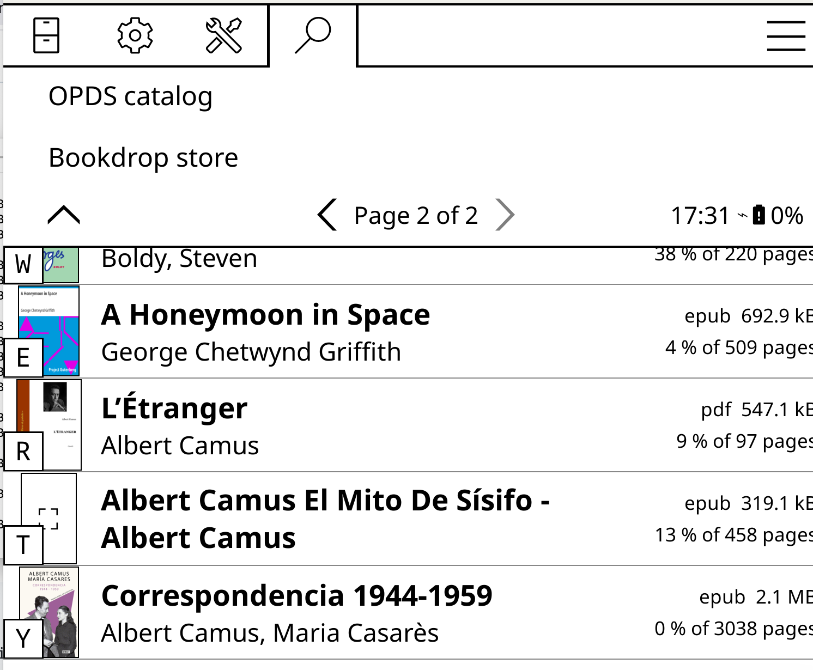
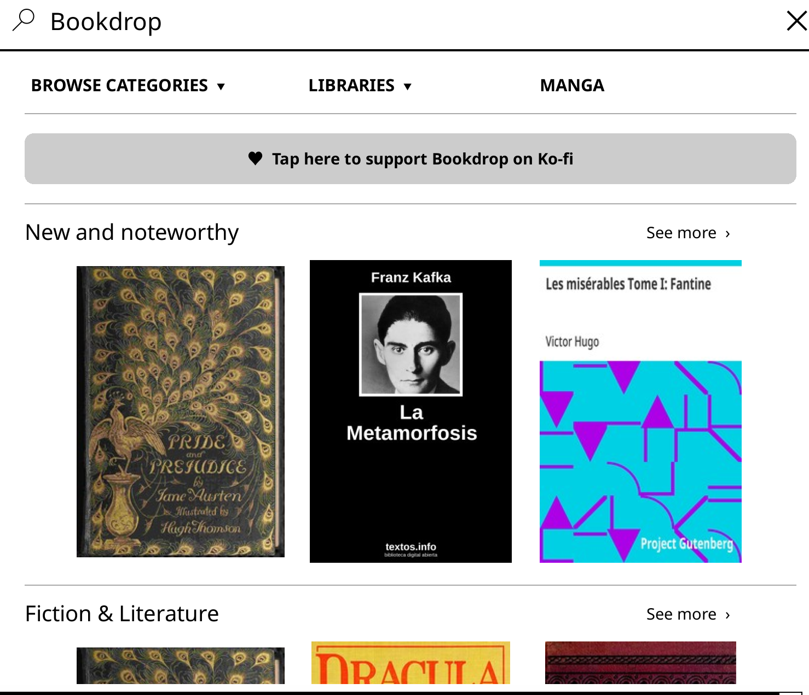
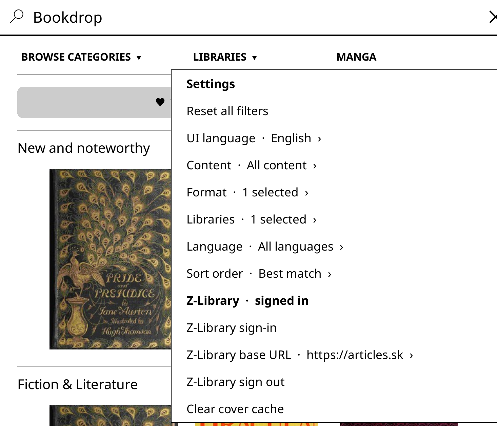
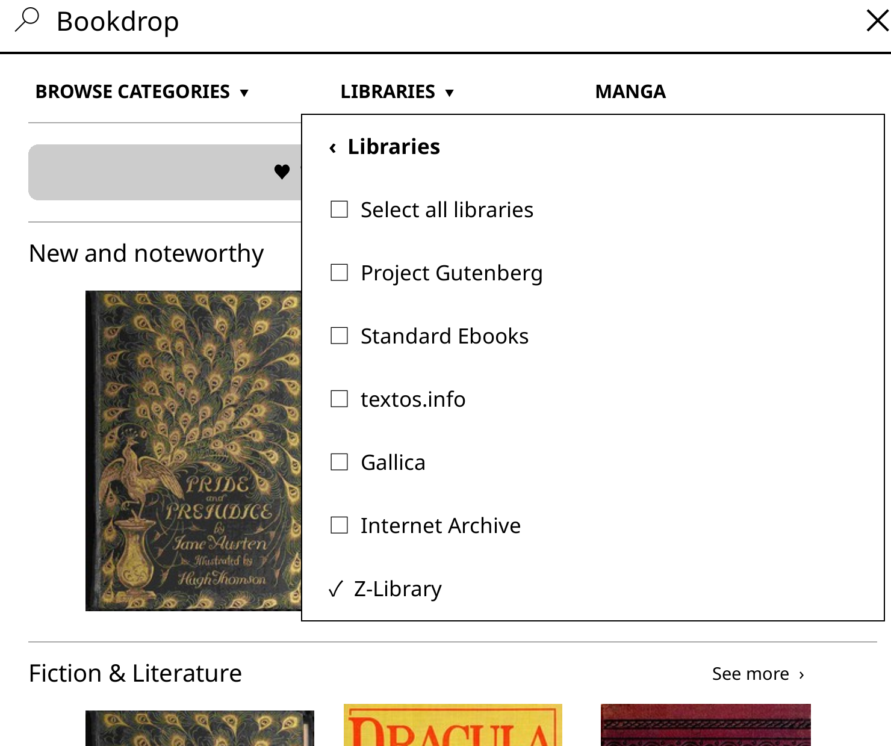
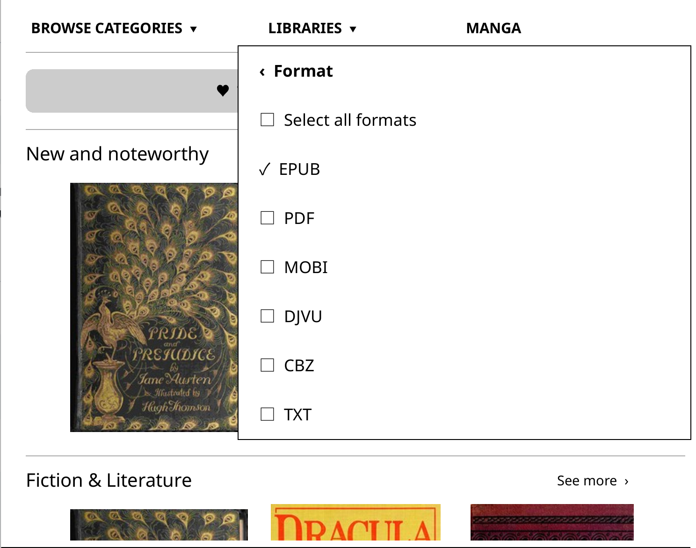
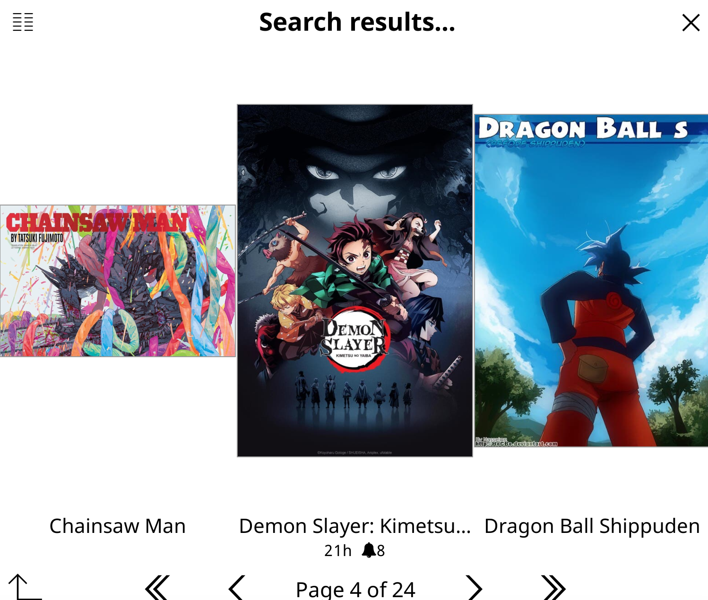

# Bookdrop

All-in-one reading for [KOReader](https://koreader.rocks/) — discover, search, and download books or manga without leaving your e-reader.

[](https://ko-fi.com/davidc465)

## Installation

1. Download `Bookdrop-latest.zip` from the [latest GitHub release](https://github.com/codep-alt/bookdrop/releases/latest).
2. Extract the ZIP and copy the resulting `bookdrop.koplugin` folder into KOReader's `plugins` directory.
3. Confirm the final path is `koreader/plugins/bookdrop.koplugin/main.lua`, without an extra nested folder.
4. Restart KOReader.
5. Open KOReader's main menu and select **Bookdrop store**.

An internet connection is required for live catalogs and downloads. The curated landing page and previously cached covers can still be displayed offline.

## Screenshots

### Open Bookdrop from KOReader

<p align="center">
  
</p>

### Browse and configure the catalog

<table>
  <tr>
    <td align="center"><br><sub>Curated home and categories</sub></td>
    <td align="center"><br><sub>Settings and Z-Library account</sub></td>
  </tr>
  <tr>
    <td align="center"><br><sub>Choose catalog libraries</sub></td>
    <td align="center"><br><sub>Choose download formats</sub></td>
  </tr>
</table>

### Search books and manga

<table>
  <tr>
    <td align="center"><br><sub>Book results in cover view</sub></td>
    <td align="center"><br><sub>Manga search results</sub></td>
  </tr>
</table>

A short walkthrough video will be added later.

## Features

- **One search across multiple catalogs.** Search by title, author, ISBN, or keyword across Project Gutenberg, Standard Ebooks, textos.info, Gallica, Internet Archive, and optionally Z-Library.
- **Cover-first interface.** Browse in compact list or cover-grid mode, with progressively loaded and cached cover art designed for e-ink screens.
- **Detailed book pages.** Review author, publisher, publication date, language, formats, subjects, ISBN, description, rights, and other metadata when supplied by the catalog.
- **Book and cover downloads.** Download a supported book file or save its JPEG/PNG cover separately to KOReader's configured download directory.
- **Safer transfers.** Downloads use temporary `.part` files, reject empty or HTML sign-in responses, preserve the existing file, and verify MD5 checksums when a catalog provides one.
- **Filters and sorting.** Select one or more formats and libraries, filter by language or content type, and sort by best match, title, newest publication, or oldest publication.
- **Curated home.** Start from hand-picked fiction, non-fiction, comics, magazines, Spanish, and French shelves. The initial shelf and cover artwork work without a catalog request.
- **Recent books and incremental results.** Reopen recently viewed books and load more results without replacing the books already displayed.
- **UI language selector.** Change KOReader's interface language from Bookdrop settings. English, Spanish, French, German, Italian, Portuguese, Brazilian Portuguese, Russian, Simplified Chinese, Traditional Chinese, and Japanese are included in the selector. KOReader asks for a restart after a language change.
- **Integrated manga reader.** Browse, track, download, and read manga through the bundled RakuYomi interface and Aidoku-compatible sources.

## Catalogs

| Catalog | Enabled initially | Notes |
| --- | --- | --- |
| Project Gutenberg | Yes | Public-domain books and direct downloads |
| Standard Ebooks | Yes | Carefully produced public-domain ebooks |
| textos.info | Yes | Spanish-language catalog |
| Gallica | Yes | Digital collections from the Bibliothèque nationale de France |
| Internet Archive | Yes | Broad archive with format and checksum metadata |
| Z-Library | No | Requires the user's own account; enable it under **Settings → Libraries** |

Catalogs are independent. If one service is unavailable, Bookdrop keeps results from the services that answered and reports the partial failure in the results subtitle.

### Language filtering

The catalog language filter is separate from the UI language setting. Bookdrop sends the selected language to Internet Archive and Z-Library and filters OPDS results using their language metadata. Supported choices are English, Spanish, French, German, Russian, Portuguese, Italian, Chinese, and Japanese.

Language metadata is controlled by each catalog, so filtering is best effort when a source omits or mislabels a book's language.

## Z-Library

Z-Library support is optional and disabled on a new installation. To use it:

1. Open **Bookdrop → Settings → Libraries** and enable **Z-Library**.
2. Open **Settings → Z-Library sign-in** and enter your account details.
3. Search normally. Z-Library results are merged with the enabled public catalogs.

Bookdrop follows the same eAPI approach as the upstream KOReader Z-Library plugin. It remembers a working mirror, falls back when a mirror times out, loops, or returns a landing page, preserves redirect challenge cookies, and resolves a fresh signed link immediately before downloading.

Z-Library credentials and session identifiers are stored locally in KOReader's settings directory. They are never placed in recent-book records or release packages. Bookdrop is not affiliated with Z-Library, and account or download limits still apply.

## Manga

The Manga tab bundles the RakuYomi interface and seven ready-to-use sources:

- MangaDex
- WEBTOON
- MangaPill
- Weeb Central
- Asura Scans
- Bato.to
- TCB Scans

More sources can be installed from the Aidoku community catalog inside the app.

The manga reader requires a small RakuYomi runtime (approximately 25 MB). The first time the Manga tab is opened, Bookdrop detects the platform and offers to download the matching runtime. This is a one-time download and can be retried or postponed.

## Settings

Bookdrop settings are available from the store's top menu:

- Reset all filters
- KOReader UI language
- Content type
- Download formats: EPUB, PDF, MOBI, DJVU, CBZ, and TXT
- Enabled libraries
- Catalog language
- Sort order
- Z-Library sign-in, sign-out, and base URL

Downloaded books and covers are saved to KOReader's configured download directory. Bookdrop itself adds no analytics or telemetry.

## Troubleshooting

- **A catalog is slow or unavailable:** disable that library temporarily under **Settings → Libraries**. Other enabled catalogs can continue returning results.
- **Z-Library asks you to sign in again:** open Bookdrop settings, sign out, and sign in again so the local session can be refreshed.
- **A Z-Library mirror changed:** Bookdrop normally selects another working mirror automatically. The base URL can also be changed manually in settings.
- **A download fails:** verify Wi-Fi, free storage, and the account's download allowance. Bookdrop removes incomplete `.part` files after a failed transfer.
- **Manga is unavailable:** reopen the Manga tab and retry the runtime download. The device needs `curl` or BusyBox `wget`, plus `unzip` or BusyBox `unzip`.
- **The interface language did not change:** accept KOReader's restart prompt or restart KOReader manually.

## Building a release ZIP

```sh
dev/package.sh
```

This refreshes the bundled `.aix` manga sources and creates `Bookdrop-latest.zip`. The device-specific RakuYomi binaries are excluded because they are downloaded on first use.

## Development

Useful scripts:

```sh
dev/fetch-manga-binaries.sh latest macos     # Pre-install binaries for local testing
dev/fetch-popular-sources.sh                 # Refresh bundled .aix source files
dev/run-emulator.sh                          # Launch the KOReader emulator
```

Run the provider regression suite:

```sh
python3 -m venv .venv
.venv/bin/pip install lupa
.venv/bin/python tests/test_provider.py
```

Before publishing, also compile the Lua files, run `git diff --check`, build the release ZIP, and verify it with `unzip -t Bookdrop-latest.zip`.

## Privacy and service availability

Bookdrop connects directly to the catalogs and source sites selected by the user. Those third-party services have their own terms, availability, regional restrictions, and privacy policies. Catalog domains and APIs can change independently of Bookdrop.

Users are responsible for following applicable laws and the terms of each service when accessing or downloading content.

## Credits

Bookdrop incorporates code from these projects:

- **[RakuYomi](https://github.com/tachibana-shin/rakuyomi)** (AGPL-3.0) — manga reader, bundled under `bookdrop.koplugin/manga/`
- **[Z-Library plugin](https://github.com/ZlibraryKO/zlibrary.koplugin)** (AGPL-3.0) — eAPI client, ported into `bookdrop.koplugin/bookdrop_zlibrary_provider.lua`

The pre-installed manga sources come from the [Aidoku community catalog](https://github.com/tachibana-shin/aidoku-community-sources).

## Support

If Bookdrop is useful to you, you can support continued development on [Ko-fi](https://ko-fi.com/davidc465). The app also includes an e-ink-friendly QR code for opening the support page on a phone.

## License

Bookdrop is licensed under the GNU Affero General Public License v3.0. See [LICENSE](LICENSE) and [NOTICE](bookdrop.koplugin/NOTICE).
